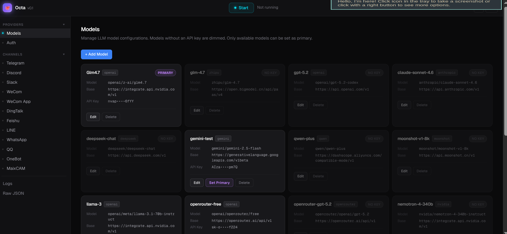

<div align="center">

# 🐙 Octa

**Your personal AI agent — it talks, it acts, it remembers.**

[](https://golang.org)
[](LICENSE)
[](https://github.com/Swarup012/Octa/actions)

[What is this?](#-what-is-octa) • [Why use it?](#-why-octa) • [Use cases](#-how-octa-helps) • [Get started](#-quick-start) • [Docker](#-docker) • [Reference](#-reference)

</div>

---

## 💡 What is Octa?

Octa is a **personal AI agent** that runs on your own machine. You pick an LLM (Claude, Gemini, GPT-4, Llama — your choice), and Octa gives it hands: it can check your calendar, send emails, manage tasks, search the web, play music, run shell commands, and much more.

You talk to Octa through **Telegram, Discord, Slack, WhatsApp**, or just your terminal. It remembers your conversations, runs background jobs on a schedule, and executes multiple tools in parallel so responses feel instant.

Inspired by [OpenClaw](https://github.com/OpenClaw-project) — rewritten in Go to be **50x lighter**. No Node.js, no bloat. Runs on a Raspberry Pi.

No cloud subscription. No data leaving your machine. Your keys, your rules.



---

## 🔥 Why Octa?

You've used ChatGPT. You've used Claude. They're great — until you realize they can't *do* anything. They can't check your calendar. They can't send that email you drafted. They can't look up your todos and remind you before the meeting.

You end up copy-pasting between 10 tabs. Your AI assistant is just a chatbot with amnesia.

**Octa fixes this.**

| Problem | How Octa solves it |
|---------|-------------------|
| AI can't access your tools | Connects to Google Calendar, Gmail, Todoist, RSS feeds, and more |
| AI forgets everything | Persistent sessions with automatic summarization |
| AI is slow with multiple tasks | Parallel tool execution — runs 5 tools at once |
| AI only works in one tab | Works on Telegram, Discord, Slack, WhatsApp, or terminal |
| AI costs money every month | Runs on your machine with your own API keys (Gemini free tier works) |
| AI can't do background work | Built-in scheduler for reminders, email dispatch, RSS polling |

### Octa vs OpenClaw

Octa is inspired by [OpenClaw](https://github.com/OpenClaw-project), but rebuilt from the ground up in Go for one reason: **it should run on anything**.

| | OpenClaw | Octa |
|--|----------|------|
| **Language** | Node.js | Go |
| **Memory usage** | ~1 GB | ~20 MB |
| **Runs on** | Needs a beefy machine (Mac Mini recommended) | A $5 VPS, a Raspberry Pi, your old laptop |
| **Binary size** | Requires Node.js runtime | Single static binary, no runtime |
| **Startup time** | Seconds (Node.js boot) | Instant |
| **Docker image** | 1+ GB | ~540 MB (with mpv/ffmpeg included) |

You don't need to buy a Mac Mini. Octa runs comfortably on a 1 GB RAM droplet. It's a Go binary — no Node.js, no npm, no dependency hell.

---

## 🎯 How Octa Helps

Here are real things people do with Octa every day:

### Morning routine
> "What's on my calendar today? Any urgent emails? What tasks are due?"

Octa checks your Google Calendar, scans your Gmail inbox, and pulls your Todoist tasks — all in one response, all in parallel.

### Quick actions from chat
> "Schedule a meeting with Alex tomorrow at 3pm"
> "Send an email to the team: standup is cancelled today"
> "Add 'buy groceries' to my todo list"

No app switching. Just type it in Telegram/Discord and Octa handles it.

### Stay informed
> "Any new articles from Hacker News today?"
> "Search the web for the latest Go 1.25 features"

Octa's RSS reader auto-fetches feeds every 30 minutes and can summarize new articles on demand.

### Background automation
> "Remind me 10 minutes before every meeting"
> "Email me a digest of unread RSS articles every morning at 8am"

Octa's scheduler runs in the background — even when you're not chatting with it.

### Music playback
> "Play some lofi beats"
> "Pause the music" / "Volume 50"

Streams YouTube audio directly via mpv. No browser needed.

### Developer power tools
> "Run `docker ps` and show me the output"
> "Check the logs on my server"
> "Deploy the latest version"

Shell access with safety guards — deny patterns block dangerous commands by default.

---

## 🚀 Quick Start

### Prerequisites
- Go 1.21 or later
- Git
- An API key for at least one LLM provider

### 1. Build and install

```bash
git clone https://github.com/Swarup012/Octa.git
cd Octa
make build
make install
```

This installs `octa` to `~/.local/bin/octa`. Add it to your PATH:

```bash
echo 'export PATH="$HOME/.local/bin:$PATH"' >> ~/.bashrc
source ~/.bashrc
```

### 2. Configure

```bash
mkdir -p ~/.octa
cp config/config.example.json ~/.octa/config.json
```

Edit `~/.octa/config.json` — at minimum, add your API key:

```json
{
  "agents": {
    "defaults": {
      "model": "gemini-2.0-flash",
      "max_tokens": 8192,
      "max_tool_iterations": 20
    }
  },
  "model_list": [
    {
      "model_name": "gemini-2.0-flash",
      "api_base": "https://generativelanguage.googleapis.com/v1beta/openai/",
      "api_key": "YOUR_GEMINI_API_KEY",
      "model": "gemini-2.0-flash"
    }
  ]
}
```

> **Tip:** Gemini has a free tier. Get your key at https://aistudio.google.com/app/apikey

### 3. Run

```bash
# Interactive terminal session
octa agent

# One-shot query
octa agent -m "what's the weather like today?"

# Start the gateway (for Telegram/Discord/Slack bots)
octa gateway
```

---

## 🐳 Docker

```bash
# Build and start gateway bot
make docker-gateway

# Or run a one-shot query
make docker-agent ARGS='-m "what tasks do I have today?"'

# View logs
make docker-gateway-logs

# Stop
make docker-gateway-stop
```

First run creates a minimal config. Edit it:
```bash
docker exec octa-gateway cat /root/.octa/config.json > /tmp/config.json
# Edit /tmp/config.json with your API key
docker cp /tmp/config.json octa-gateway:/root/.octa/config.json
docker restart octa-gateway
```

Image includes mpv, yt-dlp, and ffmpeg for music playback out of the box.

---

## 📖 Reference

### Built-in Tools

| Tool | What it does |
|------|-------------|
| `google_calendar` | Create, list, update, delete events + Google Meet |
| `gmail` | Send, schedule, search, read emails |
| `todoist` | Full task management (create, complete, bulk, delete) |
| `rss` | Subscribe to feeds, auto-fetch every 30 min |
| `web_search` | Search the web (Brave, Tavily, DuckDuckGo, Perplexity) |
| `web_fetch` | Read any URL's content |
| `shell` | Run terminal commands (with safety guards) |
| `youtube_music` | Play YouTube audio, queue, volume, pause/resume |
| `message` | Send a message to the user mid-tool-chain |
| `spawn` | Spawn a subagent for async subtasks |
| `cron` | Schedule recurring tasks |

### Messaging Channels

Telegram, Discord, Slack, WhatsApp, DingTalk, Feishu, LINE, WeCom, QQ, OneBot.

### LLM Providers

| Provider | Config |
|----------|--------|
| **Google Gemini** | Free tier. [Get key](https://aistudio.google.com/app/apikey) |
| **Anthropic Claude** | `api_key: "sk-ant-..."` |
| **OpenRouter** | One key for Claude, GPT-4, Gemini. [Get key](https://openrouter.ai) |
| **Ollama** | Local models, no API key needed |

### CLI Commands

```bash
octa agent              # Interactive terminal session
octa agent -m "msg"     # One-shot query
octa gateway            # Start gateway (bots + background jobs)
octa auth google        # Google OAuth flow
octa status             # Health check
octa cron               # Manage scheduled tasks
octa skills             # Install/list/remove skills
octa version            # Show version
```

### Configuration

Full example: [`config/config.example.json`](config/config.example.json)

### Directory Structure

```
~/.octa/
├── config.json          # Your configuration
├── tokens/              # OAuth tokens
├── data/
│   └── scheduler.db     # SQLite: email queue + RSS cache
└── workspace/
    ├── AGENT.md         # Agent instructions
    ├── IDENTITY.md      # Agent identity
    ├── SOUL.md          # Agent personality
    ├── USER.md          # Your profile
    ├── memory/          # Long-term memory
    └── sessions/        # Conversation history
```

---

## 🧩 Skills

Extend Octa with community skills:

```bash
octa skills install weather
octa skills list
octa skills remove weather
```

---

## 🏗️ Architecture (for developers)

```
┌─────────────────────────────────────────────┐
│                   Channels                   │
│  Telegram │ Discord │ Slack │ CLI │ WhatsApp │
└──────────────────┬──────────────────────────┘
                   │ messages
                   ▼
┌──────────────────────────────────────────────┐
│              Message Bus (pkg/bus)            │
└──────────────────┬───────────────────────────┘
                   │
                   ▼
┌──────────────────────────────────────────────┐
│           Agent Loop (pkg/agent)             │
│  Session → System Prompt → LLM → Tool Calls  │
└──────────────────┬───────────────────────────┘
                   │ parallel execution
        ┌──────────┼──────────┐
        ▼          ▼          ▼
   Calendar      Gmail     Todoist    RSS ...

┌──────────────────────────────────────────────┐
│         Shared Scheduler (pkg/scheduler)      │
│  email_dispatch │ meeting_reminder │ rss_fetch│
└──────────────────────────────────────────────┘
```

---

## 🤝 Contributing

```bash
make test    # Run tests
make lint    # Run linter
make fmt     # Format code
```

---

## 📄 License

MIT — see [LICENSE](LICENSE).

---

<div align="center">
Made with 🐙 by <a href="https://github.com/Swarup012">Swarup</a>
</div>
